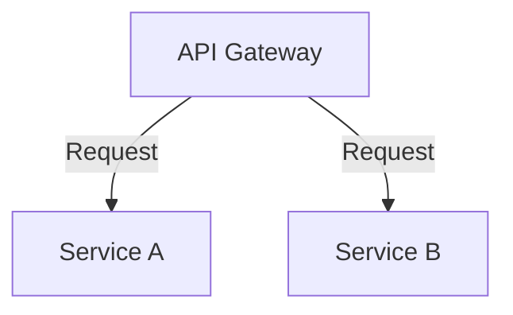

# GitHub Copilot Bootcamp Brasil 

## Overview
`ms-reactor-api` is a simple task management API built with FastAPI. It allows users to create, list, and delete tasks using an in-memory storage system. The application follows the principles of Clean Architecture, ensuring that the code is organized, maintainable, and easy to understand.

## Features
- Create a new task
- List all tasks
- Delete a task by ID

## Project Structure
```
ms-reactor-api
├── app
│   ├── api
│   │   ├── __init__.py
│   │   ├── dependencies.py
│   │   ├── task.py
│   ├── core
│   │   ├── __init__.py
│   │   ├── config.py
│   ├── models
│   │   ├── __init__.py
│   │   ├── task.py
│   ├── repositories
│   │   ├── __init__.py
│   │   ├── memory.py
│   ├── schemas
│   │   ├── __init__.py
│   │   ├── task.py
│   ├── services
│   │   ├── __init__.py
│   │   ├── task_service.py
│   ├── main.py
├── requirements.txt
└── README.md
```

## Installation
1. Clone the repository:
   ```
   git clone https://github.com/yourusername/ms-reactor-api.git
   cd ms-reactor-api
   ```

2. Create a virtual environment:
   ```
   python -m venv venv
   source venv/bin/activate  # On Windows use `venv\Scripts\activate`
   ```

3. Install the required dependencies:
   ```
   pip install -r requirements.txt
   ```

## Usage
To run the application, execute the following command:
```
uvicorn app.main:app --reload
```

The API will be available at `http://127.0.0.1:8000`.

## API Endpoints
- **Create Task**: `POST /tasks`
- **List Tasks**: `GET /tasks`
- **Delete Task**: `DELETE /tasks/{task_id}`

## Example `curl` Commands

### Create a Task
```sh
curl -X POST "http://127.0.0.1:8000/tasks/" -H "Content-Type: application/json" -d '{"title": "New Task", "description": "This is a new task"}'
```

## Testing
To run the tests, execute the following 
```sh
pytest
```
## Microsoft Reactor Series
This project is part of the Microsoft Reactor series. For more information and to follow along with the series, visit the Microsoft Reactor Series.

## Contributing
Feel free to submit issues or pull requests to improve the project.
 

## License
This project is licensed under the MIT License.

# Documentação da API

## Arquitetura

Este diagrama mostra a arquitetura básica da API:



A arquitetura consiste em um API Gateway que encaminha solicitações para dois serviços principais: Service A e Service B.

## Endpoints da API

### API Gateway

#### **GET /api/serviceA**

- **Descrição**: Retorna dados do Service A.
- **Parâmetros**: Nenhum.
- **Resposta**:
  - **200 OK**: Retorna os dados do Service A.
  - **Exemplo**:
    ```json
    {
      "data": "example data from Service A"
    }
    ```

#### **POST /api/serviceA**

- **Descrição**: Envia dados para o Service A.
- **Parâmetros**:
  - **body**: JSON contendo os dados a serem enviados.
- **Resposta**:
  - **201 Created**: Confirmação de que os dados foram recebidos.
  - **Exemplo**:
    ```json
    {
      "message": "Data received by Service A"
    }
    ```

#### **GET /api/serviceB**

- **Descrição**: Retorna dados do Service B.
- **Parâmetros**: Nenhum.
- **Resposta**:
  - **200 OK**: Retorna os dados do Service B.
  - **Exemplo**:
    ```json
    {
      "data": "example data from Service B"
    }
    ```

#### **POST /api/serviceB**

- **Descrição**: Envia dados para o Service B.
- **Parâmetros**:
  - **body**: JSON contendo os dados a serem enviados.
- **Resposta**:
  - **201 Created**: Confirmação de que os dados foram recebidos.
  - **Exemplo**:
    ```json
    {
      "message": "Data received by Service B"
    }
    ```

### Service A

#### **GET /serviceA/resource**

- **Descrição**: Retorna uma lista de recursos do Service A.
- **Parâmetros**: Nenhum.
- **Resposta**:
  - **200 OK**: Retorna a lista de recursos.
  - **Exemplo**:
    ```json
    {
      "resources": ["resource1", "resource2"]
    }
    ```

#### **POST /serviceA/resource**

- **Descrição**: Cria um novo recurso no Service A.
- **Parâmetros**:
  - **body**: JSON contendo os dados do novo recurso.
- **Resposta**:
  - **201 Created**: Confirmação de que o recurso foi criado.
  - **Exemplo**:
    ```json
    {
      "message": "Resource created in Service A"
    }
    ```

### Service B

#### **GET /serviceB/resource**

- **Descrição**: Retorna uma lista de recursos do Service B.
- **Parâmetros**: Nenhum.
- **Resposta**:
  - **200 OK**: Retorna a lista de recursos.
  - **Exemplo**:
    ```json
    {
      "resources": ["resource1", "resource2"]
    }
    ```

#### **POST /serviceB/resource**

- **Descrição**: Cria um novo recurso no Service B.
- **Parâmetros**:
  - **body**: JSON contendo os dados do novo recurso.
- **Resposta**:
  - **201 Created**: Confirmação de que o recurso foi criado.
  - **Exemplo**:
    ```json
    {
      "message": "Resource created in Service B"
    }
    ```