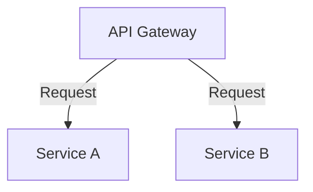

# Documentação da API

## Arquitetura

Este diagrama mostra a arquitetura básica da API:



A arquitetura consiste em um API Gateway que encaminha solicitações para dois serviços principais: Service A e Service B.

## Endpoints da API

### API Gateway

#### **GET /api/serviceA**

- **Descrição**: Retorna dados do Service A.
- **Parâmetros**: Nenhum.
- **Resposta**:
  - **200 OK**: Retorna os dados do Service A.
  - **Exemplo**:
    ```json
    {
      "data": "example data from Service A"
    }
    ```

#### **POST /api/serviceA**

- **Descrição**: Envia dados para o Service A.
- **Parâmetros**:
  - **body**: JSON contendo os dados a serem enviados.
- **Resposta**:
  - **201 Created**: Confirmação de que os dados foram recebidos.
  - **Exemplo**:
    ```json
    {
      "message": "Data received by Service A"
    }
    ```

#### **GET /api/serviceB**

- **Descrição**: Retorna dados do Service B.
- **Parâmetros**: Nenhum.
- **Resposta**:
  - **200 OK**: Retorna os dados do Service B.
  - **Exemplo**:
    ```json
    {
      "data": "example data from Service B"
    }
    ```

#### **POST /api/serviceB**

- **Descrição**: Envia dados para o Service B.
- **Parâmetros**:
  - **body**: JSON contendo os dados a serem enviados.
- **Resposta**:
  - **201 Created**: Confirmação de que os dados foram recebidos.
  - **Exemplo**:
    ```json
    {
      "message": "Data received by Service B"
    }
    ```

### Service A

#### **GET /serviceA/resource**

- **Descrição**: Retorna uma lista de recursos do Service A.
- **Parâmetros**: Nenhum.
- **Resposta**:
  - **200 OK**: Retorna a lista de recursos.
  - **Exemplo**:
    ```json
    {
      "resources": ["resource1", "resource2"]
    }
    ```

#### **POST /serviceA/resource**

- **Descrição**: Cria um novo recurso no Service A.
- **Parâmetros**:
  - **body**: JSON contendo os dados do novo recurso.
- **Resposta**:
  - **201 Created**: Confirmação de que o recurso foi criado.
  - **Exemplo**:
    ```json
    {
      "message": "Resource created in Service A"
    }
    ```

### Service B

#### **GET /serviceB/resource**

- **Descrição**: Retorna uma lista de recursos do Service B.
- **Parâmetros**: Nenhum.
- **Resposta**:
  - **200 OK**: Retorna a lista de recursos.
  - **Exemplo**:
    ```json
    {
      "resources": ["resource1", "resource2"]
    }
    ```

#### **POST /serviceB/resource**

- **Descrição**: Cria um novo recurso no Service B.
- **Parâmetros**:
  - **body**: JSON contendo os dados do novo recurso.
- **Resposta**:
  - **201 Created**: Confirmação de que o recurso foi criado.
  - **Exemplo**:
    ```json
    {
      "message": "Resource created in Service B"
    }
    ```

## Instruções de Uso

### Instalação

Para instalar as dependências do projeto, execute:

```sh
pip install -r requirements.txt
```

### Executando a API

Para iniciar a API, execute:

```sh
uvicorn main:app --reload
```

### Testes

Para rodar os testes, execute:

```sh
pytest
```
